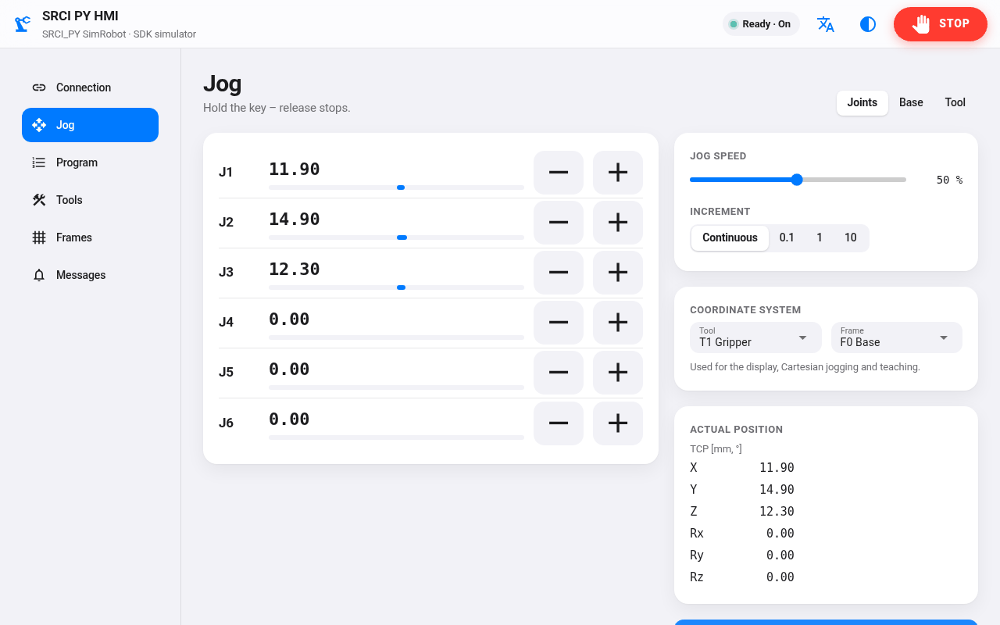
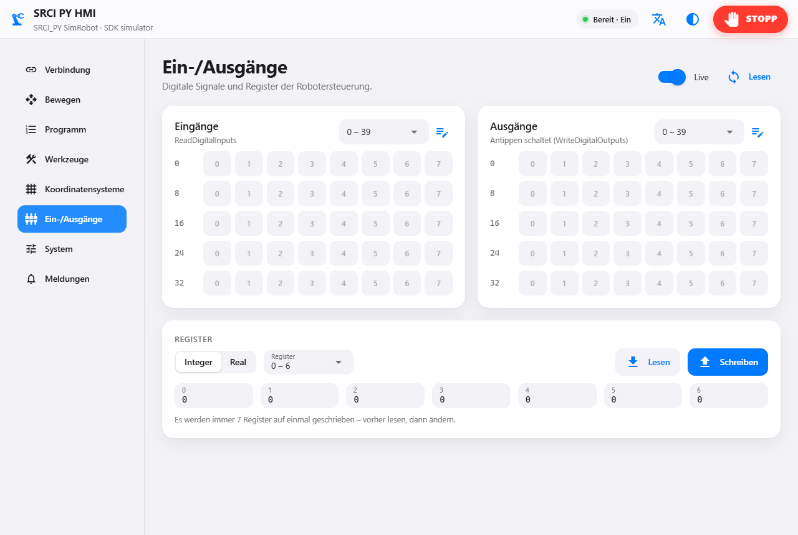
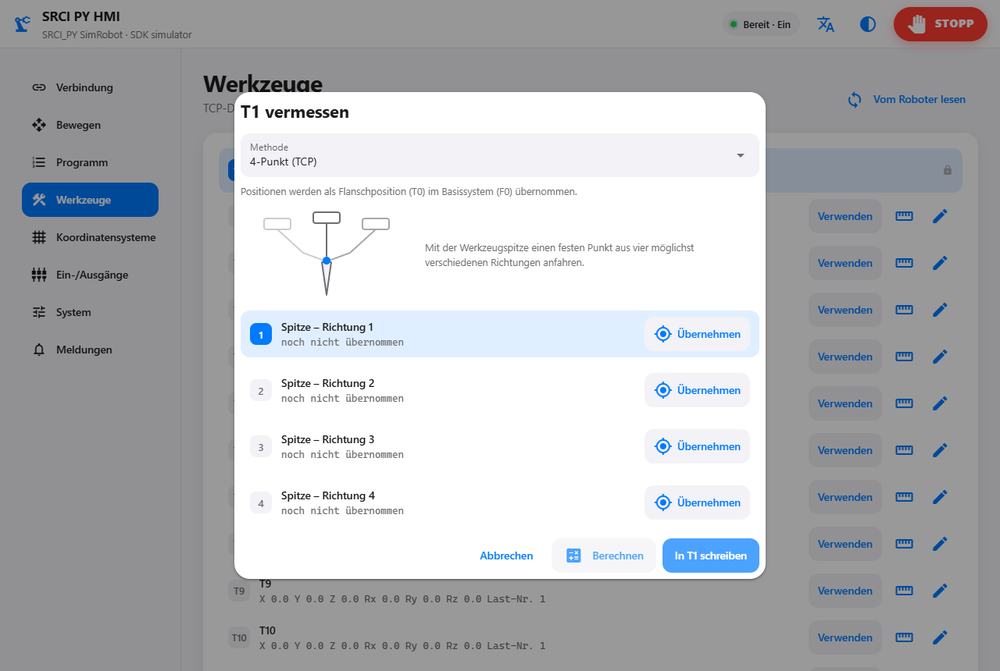

# SRCI_PY_HMI – Bedienoberfläche zum Einrichten und Teachen von SRCI-Robotern

Eine Weboberfläche im Stil eines Tablets (NiceGUI) auf Basis des Python-Clients
[`srci`](https://github.com/ThorstenBrach/SRCI_CLIENT_PY) (SRCI_PY). Man verbindet sich damit über das SPS-Gateway mit dem Roboter, schaltet ihn ein,
verfährt ihn per Tippbetrieb, teacht Punkte und fährt daraus Programme ab.

<p>
  
  
  
  
</p>

```
Browser / Tablet  --HTTP-->  srci-hmi (Python, NiceGUI)  --TCP-->  SPS-Gateway  --PROFINET-->  Roboter
                                     └─ oder: SRCI-SDK-Simulator (lokal, ohne Roboter)
```

## Funktionen

| Seite | Inhalt |
|---|---|
| **Verbindung** | Roboter (IP/Port/Telegrammlänge des Gateways) oder SDK-Simulator, LifeSign-Timeout (100/250/500/1000 ms oder frei, wird gemerkt), Roboter ein/aus (quittiert vorher anstehende Fehler mit GroupReset), Quittieren, Geschwindigkeits-Override, Roboterdaten und **Fähigkeiten**: welche Funktionen die Steuerung in `RCSupportedFunctions` meldet. Nicht gemeldete Funktionen werden in der Oberfläche gesperrt und nie gesendet. Status-Kacheln (Antriebe, Fehler, Kommunikation, Sequenz), **Betriebsart** Automatik / T1 / T2 extern (SetOperationMode), **Grundstellung** sichern und anfahren, **Diagnose** (auf der Bahn, Sekundärsequenz, Betriebsstunden, letzte Fehler-IDs) |
| **Bewegen** | Tippen in Achsen, Basis oder Werkzeug, stufenlos oder in Schritten (0,1 / 1 / 10), Tippgeschwindigkeit. Auswahl von Werkzeug und Koordinatensystem; diese gelten für die TCP-Anzeige, das kartesische Tippen und das Teachen (der Punkt merkt sich Tool und Frame). Live-Position, „Punkt teachen“, **Handführen** (FreeDrive, gedrückt halten), **Zielposition anfahren**: Achswerte oder kartesische Werte eingeben (Joint / PTP / LIN) |
| **Programm** | Punkte (anfahren, neu teachen, umbenennen, löschen) und Ablauf. Einen Schritt antippen öffnet den Editor: Bewegungsart **LIN** (MoveLinearAbsolute), **PTP** (MoveDirectAbsolute, kartesisches Ziel achsinterpoliert) oder **Joint** (MoveAxesAbsolute, Achswinkel), jeweils mit Genauhalt oder Überschleifen (Art laut Spez, Wert vor dem Punkt und – bei „zwei Radien“ – nach dem Punkt; Arten, die der Roboter in dieser Verbindung abgelehnt hat, sind markiert), dazu Geschwindigkeit, Beschleunigung, Verzögerung und Ruck in % oder „Standard“ der RC. Weitere Schrittarten: **CIRC** über einen Hilfspunkt (MoveCircularAbsolute), **relativ** verfahren (MoveLinear/Direct/AxesRelative, im Werkzeug oder Koordinatensystem), **Warten**, **Ausgang setzen** (WriteDigitalOutputs), **auf Eingang warten** (ReadDigitalInputs, mit Timeout), **Unterprogramm** (CallSubprogram) und **Haltepunkt**. Schritte lassen sich überspringen und kommentieren; **Ablauf-Einstellungen** setzen Überschleifen und Dynamik für alle Schritte. Punkte numerisch bearbeiten (mit Vorwärts-/Rückwärtskinematik der RC) und **verschieben, spiegeln, drehen** (ShiftPosition). Start, Einzelschritt, **Schritt zurück**, Statuszeile mit Fortschritt, **Pause / Fortsetzen** und **Zurück zur Bahn** (GroupInterrupt, GroupContinue, ReturnToPrimary), Sichern und Öffnen als JSON |
| **Werkzeuge** | Tool-Tabelle der Robotersteuerung lesen (ReadToolData) und einzelne Tools schreiben (WriteToolData): X, Y, Z, Rx, Ry, Rz, Last-Nr., externer TCP. Lokale Bezeichnungen wie „Greifer“ stehen in `programs/labels.json`. T0 (Flansch) ist fest. **Vermessen** mit der RC (CalculateTool: 3-, 4-, 5-, 6-Punkt, 2-Punkt + Z, ABC Welt, ABC 2-Punkt); der Assistent hat eigene Tipp-Tasten, man verfährt den Roboter direkt im Dialog. Meldet die Robotersteuerung `CalculateTool` / `CalculateFrame` nicht (Profil Core, z. B. JAKA MiniCobo), rechnet die HMI selbst: Werkzeug 3-/4-Punkt und ABC-Welt, Koordinatensystem 3-, 4- und 1-Punkt. **Lasten** lesen und schreiben (Read/WriteLoadData: Masse, Schwerpunkt, Trägheit) |
| **Koordinatensysteme** | Frames lesen und schreiben (Read/WriteFrameData), mit Bezugssystem. „Aktuelle TCP-Position übernehmen“ setzt den Ursprung eines Frames auf den TCP. F0 (Basis) ist fest. **Vermessen** mit der RC (CalculateFrame: 3-Punkt, 4-Punkt mit Ursprungsverschiebung, 1-Punkt) |
| **Ein-/Ausgänge** | Digitale Ein- und Ausgänge als Signal-Raster, live gelesen (Read/WriteDigitalInputs/Outputs); Ausgänge antippen schaltet. Lokale Bezeichnungen je Signal. Integer- und Real-Register lesen und schreiben (Read/WriteIntegers, Read/WriteReals) |
| **System** | Standard- und Referenzdynamik (Read/WriteRobotDefault/ReferenceDynamics), Software-Endschalter mit Balken und aktueller Achsposition (Read/WriteRobotSWLimits, Werkseinstellung), DH-Parameter, **Systemvariablen** mit der Standard-Parameterliste der Spezifikation oder Herstellerparametern (Read/WriteSystemVariable), Kinematik-Rechner (CalculateForward/InverseKinematic) |
| **Meldungen** | Meldungen der Robotersteuerung mit Zeitpunkt (erstmals gesehen), Quittieren und der letzte Fehler |

Immer sichtbar: der Status („Bereit · Ein“, „Fährt“, „Unterbrochen“, „Störung“ …), während einer
Bewegung die Taste **Pause / Fortsetzen** und die rote **STOPP**-Taste (GroupStop). Texte auf Deutsch und Englisch, helles und dunkles Design.

## Sicherheit

- **Halten zum Fahren:** Tippen, „Anfahren“ und der Programmstart fahren nur, solange die Taste
  gedrückt ist. Der Browser schickt dabei alle 100 ms ein Lebenszeichen. Fehlt es 0,5 s lang,
  stoppt der Robot-Service die Bewegung. Das greift auch, wenn man loslässt, den Tab wechselt
  oder das WLAN abbricht.
- „Ohne Halten fahren“ lässt sich auf der Programmseite einschalten (nur mit freiem
  Arbeitsraum und Not-Halt in Reichweite).
- SRCI ist keine Sicherheitsschnittstelle. Not-Halt, Schutzeinrichtungen und sichere
  Geschwindigkeiten bleiben Aufgabe der Robotersteuerung.
- Standardmäßig ist die Oberfläche nur auf dem eigenen PC erreichbar (`127.0.0.1`). Mit
  `--host 0.0.0.0` erreicht man sie auch vom Tablet aus. Dann kann aber **jeder im Netz, der den
  Port erreicht, den Roboter bewegen**. Das also nur in einem abgeschotteten Zellennetz verwenden.

## Installation

```bat
cd D:\Projekte\SRCI\SRCI_PY_HMI
python -m venv .venv
.venv\Scripts\activate
pip install -e ..\SRCI_PY
pip install -e .[dev]
```

## Start

```bat
srci-hmi                                     :: http://127.0.0.1:8080, Gateway 192.168.2.10:5000
srci-hmi --robot 192.168.2.10 --robot-port 5000 --length 256
srci-hmi --lifesign 500                      :: LifeSign-Timeout [ms] (sonst der zuletzt eingestellte)
srci-hmi --simulator                         :: SDK-Simulator vorausgewählt (SRCI_SDK_SIM_LIB)
srci-hmi --log hmi.log                       :: Logdatei mit dem Systemlog aller Funktionsbausteine
srci-hmi --host 0.0.0.0 --port 8080          :: vom Tablet erreichbar (siehe Sicherheit)
srci-hmi --native                            :: eigenes Fenster statt Browser (pywebview)
```

`python -m srci_py_hmi` geht genauso. Am besten im Ordner `SRCI_PY_HMI` starten: Programme
(`programs/`) und Einstellungen des Browsers (`.nicegui/`) landen im aktuellen Ordner.

Die Programme liegen als JSON im Ordner `programs` (Option `--programs`). Sie sind lesbar
und lassen sich versionieren. Format 1 und 2 (ältere Versionen) werden weiterhin gelesen. Die
Grundstellung steht in `programs/settings.json`, lokale Bezeichnungen (Werkzeuge, Frames, Lasten,
Signale) in `programs/labels.json`.

```json
{ "format": 3, "name": "Palette",
  "points": [ { "name": "P1", "joints": [0, 30, 60, 0, 90, 0], "cartesian": [-316, -6, 208, 180, 0, 0], "tool": 0, "frame": 0, "note": "" } ],
  "steps":  [ { "point": "P1", "motion": "linear", "velocity": 50.0,
                "blending_mode": "MAX_CORNER_DEVIATION", "blending": 20.0, "blending_post": 0.0,
                "acceleration": -1.0, "deceleration": -1.0, "jerk": -1.0 },
              { "kind": "output", "signal": 3, "value": true, "note": "Greifer zu" },
              { "kind": "wait_input", "signal": 5, "value": true, "timeout": 2.0 },
              { "kind": "wait", "duration": 0.5, "enabled": false } ] }
```

`motion`: `linear`, `ptp`, `joint` oder `circ` (mit `via`); Dynamik in %, `-1` = Standard der
Robotersteuerung. `kind` (fehlt bei Bewegungen zu Punkten): `relative` (`offset`, `reference`,
`tool`, `frame`), `wait` (`duration` s), `output` / `wait_input` (`signal` = Byte · 8 + Bit,
`value`, `timeout`), `subprogram` (`job`, `data`), `halt`.

„Warten“ wartet in der HMI (nicht mit WaitTime): das geht mit jeder Robotersteuerung, und STOPP
beendet es sofort. Ausgänge, Eingänge, Warten und Unterprogramme laufen, wenn die Bewegungen davor
fertig sind (Genauhalt davor).

## Bedienung in drei Schritten

1. **Verbindung:** Robotermodus und IP prüfen, „Verbinden“ tippen, dann „Roboter einschalten“.
2. **Bewegen:** Roboter mit den −/+-Tasten verfahren und „Punkt teachen“ tippen. P1, P2 …
   werden angelegt.
3. **Programm:** Bei einem Punkt auf ▸≡ tippen, um ihn als Schritt anzuhängen. Einen Schritt
   antippen öffnet den Editor (Bewegungsart, Genauhalt oder Überschleifen, Dynamik). Mit „Start“
   (gedrückt halten) fährt man das Programm ab, mit der Nummer eines Schritts wählt man den
   Startschritt.

Mit „+ Schritt“ kommen weitere Schrittarten dazu (Kreis, relativ, Ausgang, Eingang, Warten,
Unterprogramm, Haltepunkt). Läuft ein Programm, hält **Pause** den Roboter an; danach kann man ihn
freifahren (Tippen, Handführen), mit **Zurück zur Bahn** auf die unterbrochene Bahn zurückfahren
und mit **Fortsetzen** weitermachen.

## Aufbau

| Datei | Inhalt |
|---|---|
| `src/srci_py_hmi/model.py` | Punkte, Schritte, Programm, JSON (ohne Roboter und UI) |
| `src/srci_py_hmi/robot.py` | `RobotService`: Verbindung, Befehle nacheinander, STOPP sofort, Tippen mit Watchdog, Programmablauf (zwei Bewegungen im Voraus für Überschleifen), Werkzeuge/Koordinatensysteme, Prüfung gegen `RCSupportedFunctions` |
| `src/srci_py_hmi/app.py` | Start, Kommandozeile |
| `src/srci_py_hmi/ui/pendant.py` | NiceGUI-Seite (eine Instanz pro Browser-Tab, ein Roboter für alle Tabs) |
| `src/srci_py_hmi/ui/step_editor.py` | Dialog „Schritt bearbeiten“ (alle Schrittarten), Ablauf-Einstellungen |
| `src/srci_py_hmi/ui/coords.py` | Seiten „Werkzeuge“ (mit Lasten) und „Koordinatensysteme“ |
| `src/srci_py_hmi/ui/calibrate.py` | Assistenten „Werkzeug / Koordinatensystem vermessen“ |
| `src/srci_py_hmi/ui/points.py` | Punkt bearbeiten, verschieben / spiegeln / drehen |
| `src/srci_py_hmi/ui/io_page.py` | Seite „Ein-/Ausgänge“ |
| `src/srci_py_hmi/ui/system_page.py` | Seite „System“ |
| `src/srci_py_hmi/geometry.py` | Vermessen in der HMI (TCP-Ausgleichsrechnung, Frames aus Punkten), Euler-Winkel wie in der Spezifikation |
| `src/srci_py_hmi/sysvars.py` | Standard-Parameterliste der Systemvariablen, Umrechnung der 4-Byte-Werte |
| `src/srci_py_hmi/ui/theme.py` | Farben, CSS, JavaScript für „Halten zum Fahren“ |
| `src/srci_py_hmi/i18n.py` | Texte DE/EN |

## Tests

```bat
pytest            :: Modell; Robot-Service und Oberfläche gegen den SDK-Simulator, wenn SRCI_SDK_SIM_LIB gesetzt ist
ruff check . && mypy
```

Das SRCI SDK ist lizenziert und gehört nicht in dieses Repository (siehe `.gitignore`).

## JAKA MiniCobo

Getestet mit einem JAKA MiniCobo (Controller 1.7.1, SRCI 1.1, nur Profil Core), siehe
`SRCI_PY/examples/jaka_minicobo`:

- LIN- und PTP-Schritte werden mit TurnMode FREE und ConfigMode FREE gesendet (TurnMode nimmt der
  MiniCobo nur als FREE an, ConfigMode als SAME oder FREE).
- Überschleifen nur mit **MAX_CORNER_DEVIATION** (größte Abweichung von der Ecke in mm). Andere
  Arten lehnt er mit `16#8E05` ab. Der Editor schlägt die Art vor, die der Roboter in der
  Verbindung angenommen hat.
- LifeSign-Timeout mindestens 300 ms, Standard 500 ms. Nach einem abgelehnten Befehl schaltet der
  JAKA die Antriebe ab und sendet rund 200 ms kein LifeSign. „Roboter einschalten“ quittiert den
  Fehler vorher mit GroupReset (sonst `16#8C04`).

## Änderungen

[CHANGELOG.md](CHANGELOG.md)
