# SRCI_PY_HMI – Bedienungsanleitung

Diese Anleitung beschreibt die Bedienung der HMI am Tablet oder im Browser: Roboter verbinden und
einschalten, verfahren, Punkte teachen, Programme erstellen und abfahren, Werkzeuge und
Koordinatensysteme einrichten, Ein-/Ausgänge und Systemdaten.

Installation und Start stehen in der [README](../README.md#installation).

---

## Inhalt

1. [Sicherheit](#1-sicherheit)
2. [Aufbau der Oberfläche](#2-aufbau-der-oberfläche)
3. [Verbindung: verbinden, einschalten, Betriebsart](#3-verbindung)
4. [Bewegen: tippen, handführen, teachen](#4-bewegen)
5. [Programm: Punkte und Ablauf](#5-programm)
6. [Programm abfahren, Pause, Haltepunkt](#6-programm-abfahren)
7. [Werkzeuge und Lasten](#7-werkzeuge-und-lasten)
8. [Koordinatensysteme](#8-koordinatensysteme)
9. [Ein-/Ausgänge und Register](#9-ein-ausgänge-und-register)
10. [System](#10-system)
11. [Meldungen](#11-meldungen)
12. [Was die Robotersteuerung nicht kann](#12-was-die-robotersteuerung-nicht-kann)
13. [Fehlerbehebung](#13-fehlerbehebung)

---

## 1. Sicherheit

> **SRCI ist keine Sicherheitsschnittstelle.** Not-Halt, Schutzeinrichtungen und sichere
> Geschwindigkeiten bleiben Aufgabe der Robotersteuerung. Die STOPP-Taste der HMI ersetzt den
> Not-Halt nicht.

- **Halten zum Fahren:** Tippen, Handführen, „Anfahren“, „Grundstellung anfahren“, „Zurück zur
  Bahn“ und der Programmstart fahren nur, **solange die Taste gedrückt ist**. Loslassen stoppt den
  Roboter. Dasselbe passiert, wenn der Browser-Tab gewechselt wird oder die Verbindung zum Tablet
  abreißt (spätestens nach 0,5 s).
- **Ohne Halten fahren** (Programmseite) schaltet das Halten für Programm, Anfahren und
  Grundstellung ab – nur mit freiem Arbeitsraum und dem Not-Halt in Reichweite.
- Die **STOPP**-Taste oben rechts ist immer sichtbar und hält Tippen, Bewegung und Programm sofort
  an.
- Standardmäßig ist die HMI nur auf dem eigenen PC erreichbar. Wer sie mit `--host 0.0.0.0` im
  Netz freigibt, erlaubt **jedem, der den Port erreicht, den Roboter zu bewegen** – nur im
  abgeschotteten Zellennetz.

---

## 2. Aufbau der Oberfläche

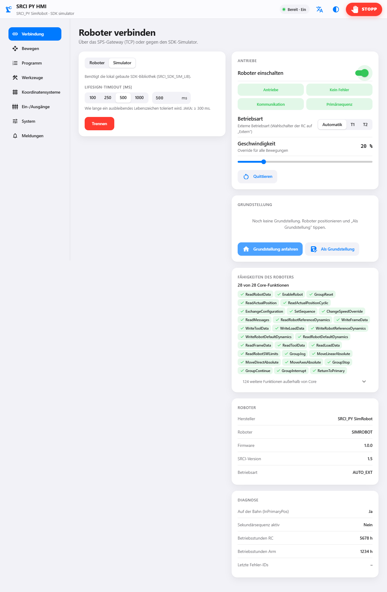

**Kopfzeile** (immer sichtbar):

| Element | Bedeutung |
|---|---|
| Status-Anzeige | `Bereit · Ein`, `Bereit · Aus`, `Tippen`, `Fährt`, `Programm läuft`, `Unterbrochen`, `Wartet am Haltepunkt`, `Störung`, `Nicht verbunden` … Punkt grün = bereit, orange = Achtung, blau = in Bewegung, rot = Fehler |
| Sprache | Deutsch / Englisch |
| Hell / Dunkel | Farbschema umschalten |
| **Pause / Fortsetzen** | erscheint nur, während sich der Roboter bewegt oder ein Programm angehalten ist |
| **STOPP** | hält alles sofort an |

**Navigation** links (auf schmalen Geräten über ☰ einblenden): Verbindung, Bewegen, Programm,
Werkzeuge, Koordinatensysteme, Ein-/Ausgänge, System, Meldungen.

Alle Einstellungen der Oberfläche (Seite, Sprache, Tippgeschwindigkeit …) merkt sich der Browser.
Mehrere Tabs oder Tablets sehen denselben Roboter und dasselbe Programm.

---

## 3. Verbindung

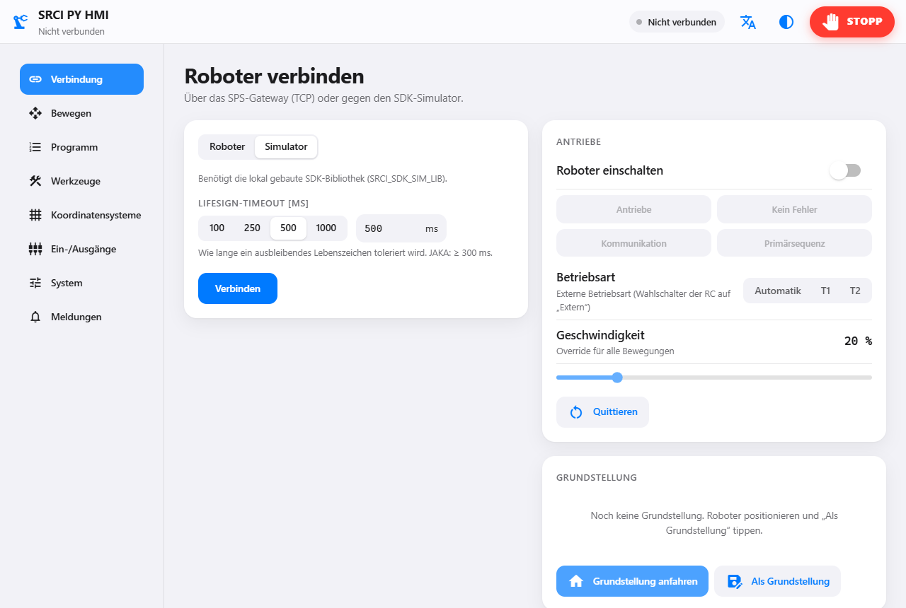

### Verbinden

1. **Roboter** oder **Simulator** wählen.
2. Beim Roboter: **IP-Adresse des Gateways**, **Port** und **Telegrammlänge** prüfen (Vorgabe aus
   der Kommandozeile).
3. **LifeSign-Timeout** wählen (100 / 250 / 500 / 1000 ms oder frei). Er wird gemerkt.
   JAKA MiniCobo: mindestens 300 ms, empfohlen 500 ms.
4. **Verbinden** tippen. Nach wenigen Sekunden zeigt die Kopfzeile den Hersteller, die Karte
   *Roboter* die Robotordaten. Mit **Trennen** wird der Roboter ausgeschaltet und die Verbindung
   beendet.

### Antriebe

| Element | Bedienung |
|---|---|
| **Roboter einschalten** | Schalter. Steht ein Fehler an, wird er vorher automatisch quittiert. |
| Status-Kacheln | **Antriebe** · **Fehler** · **Kommunikation** · **Sequenz**: grün = in Ordnung, orange = Achtung (z. B. Sekundärsequenz, unterbrochen), rot = Fehler, grau = inaktiv |
| **Betriebsart** | **Automatik**, **T1**, **T2** (externe Betriebsarten). Der Wahlschalter der Robotersteuerung muss auf „Extern“ stehen. |
| **Geschwindigkeit** | Override für alle Bewegungen in % (gilt sofort) |
| **Quittieren** | Fehler der Robotersteuerung quittieren |

### Grundstellung

- Roboter in die gewünschte Lage fahren und **Als Grundstellung** tippen. Gespeichert werden die
  Achswerte sowie Werkzeug und Koordinatensystem.
- **Grundstellung anfahren** (gedrückt halten) fährt achsweise mit der Tippgeschwindigkeit dorthin.

### Fähigkeiten, Roboter, Diagnose

- **Fähigkeiten des Roboters:** welche Funktionen die Robotersteuerung meldet. Nicht gemeldete
  Funktionen sind in der HMI gesperrt oder ausgeblendet (siehe [12.](#12-was-die-robotersteuerung-nicht-kann)).
- **Roboter:** Hersteller, Typ, Firmware, SRCI-Version, Betriebsart.
- **Diagnose:** auf der Bahn, Sekundärsequenz aktiv, Betriebsstunden der Steuerung und des Arms,
  die letzten Fehler-IDs.

---

## 4. Bewegen

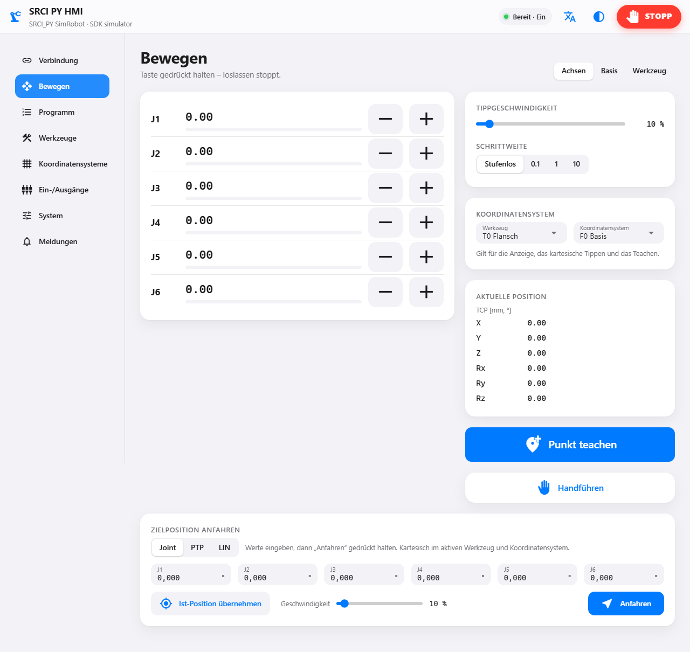

### Tippen

1. Roboter einschalten (sonst erscheint ein Hinweis mit Einschalt-Taste).
2. Oben rechts den Modus wählen:
   - **Achsen** – jede Achse einzeln (J1 … J6)
   - **Basis** – X, Y, Z, Rx, Ry, Rz im gewählten **Koordinatensystem**
   - **Werkzeug** – X, Y, Z, Rx, Ry, Rz im gewählten **Werkzeug**
3. **−** / **+** gedrückt halten. Loslassen stoppt.

| Einstellung | Bedeutung |
|---|---|
| **Tippgeschwindigkeit** | % der Tippgeschwindigkeit der Robotersteuerung |
| **Schrittweite** | **Stufenlos** (fährt, solange gedrückt) oder 0,1 / 1 / 10 mm bzw. ° je Tastendruck |
| **Koordinatensystem** | Werkzeug und Koordinatensystem: gelten für die Positionsanzeige, das kartesische Tippen und das Teachen |

Der Balken unter jedem Wert zeigt die Lage grob an (Achsen ±180°, X/Y/Z ±1000 mm).

### Handführen

**Handführen** gedrückt halten und den Roboter von Hand bewegen (nur wenn die Robotersteuerung das
anbietet, z. B. bei Cobots). Loslassen beendet das Handführen.

### Punkt teachen

Roboter in Position bringen und **Punkt teachen** tippen. Die Punkte heißen P1, P2 … und merken
sich Achswerte, TCP-Position, Werkzeug und Koordinatensystem. Sie erscheinen auf der
Programmseite.

### Zielposition anfahren

1. **Joint**, **PTP** oder **LIN** wählen.
2. Werte eingeben – bei Joint die Achswinkel, bei PTP/LIN X … Rz im aktiven Werkzeug und
   Koordinatensystem. **Ist-Position übernehmen** füllt die aktuellen Werte ein.
3. Geschwindigkeit einstellen und **Anfahren** gedrückt halten.

---

## 5. Programm

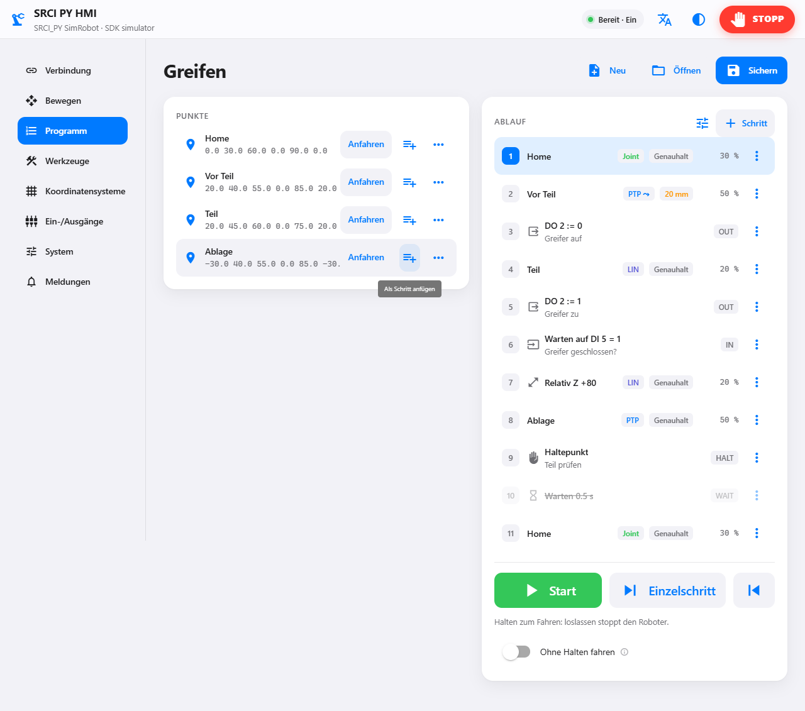

Ein Programm besteht aus **Punkten** (links) und dem **Ablauf** (rechts, die Schritte).
Oben: Programmname (antippen zum Ändern), **Neu**, **Öffnen**, **Sichern**. „nicht gesichert“
unter dem Namen zeigt ungesicherte Änderungen.

### Punkte

| Bedienung | Wirkung |
|---|---|
| **Anfahren** (halten) | fährt achsweise mit 20 % zum Punkt |
| ≡+ | hängt eine Bewegung zu diesem Punkt an den Ablauf an |
| ⋯ → **Neu teachen** | überschreibt den Punkt mit der aktuellen Position |
| ⋯ → **Bearbeiten** | Name, TCP-Werte, Achswerte, Werkzeug, Koordinatensystem, Kommentar ändern |
| ⋯ → **Verschieben / Spiegeln …** | neuen Punkt berechnen lassen (nur wenn die Robotersteuerung das anbietet) |
| ⋯ → **Umbenennen** / **Löschen** | Löschen entfernt auch die Schritte, die den Punkt nutzen |

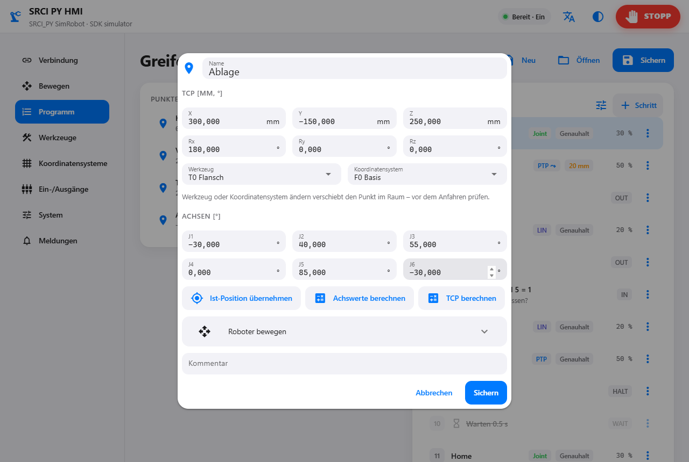

Im Dialog **Punkt bearbeiten**:

- **Ist-Position übernehmen** setzt Achs- und TCP-Werte auf die aktuelle Position.
- **Achswerte berechnen** / **TCP berechnen** rechnen mit der Kinematik der Robotersteuerung aus den
  TCP-Werten die Achswerte bzw. umgekehrt.
- **Roboter bewegen** klappt Tipp-Tasten auf, um den Roboter zu verfahren, ohne den Dialog zu
  verlassen.
- Wird Werkzeug oder Koordinatensystem geändert, bleibt der Zahlenwert gleich – der Punkt liegt
  dann woanders im Raum. Vor dem Anfahren prüfen.

**Verschieben / Spiegeln:** Transformation wählen (verschieben um Vektor, spiegeln an Punkt,
Gerade oder Ebene, drehen um Gerade), Werte eingeben, **Als neuer Punkt** oder **Punkt ersetzen**.

### Ablauf

| Bedienung | Wirkung |
|---|---|
| Schritt antippen | öffnet den Editor |
| Nummer antippen | wählt den **Startschritt** (blau hinterlegt) |
| ⋮ | Bearbeiten, **Überspringen** / **Wieder ausführen**, Duplizieren, Nach oben, Nach unten, Löschen |
| **+ Schritt** | neuen Schritt einfügen (hinter dem gewählten Schritt) |
| Regler-Symbol neben **+ Schritt** | **Ablauf-Einstellungen** für alle Schritte |

Übersprungene Schritte sind durchgestrichen und werden beim Abfahren ausgelassen. Kürzel rechts:
Bewegungsart (**Joint**, **PTP**, **LIN**, **CIRC**, `⤳` = überschliffen), Überschleifen
(`Genauhalt` oder Wert), Geschwindigkeit. Rot durchgestrichen = die Robotersteuerung unterstützt
das nicht oder hat es abgelehnt.

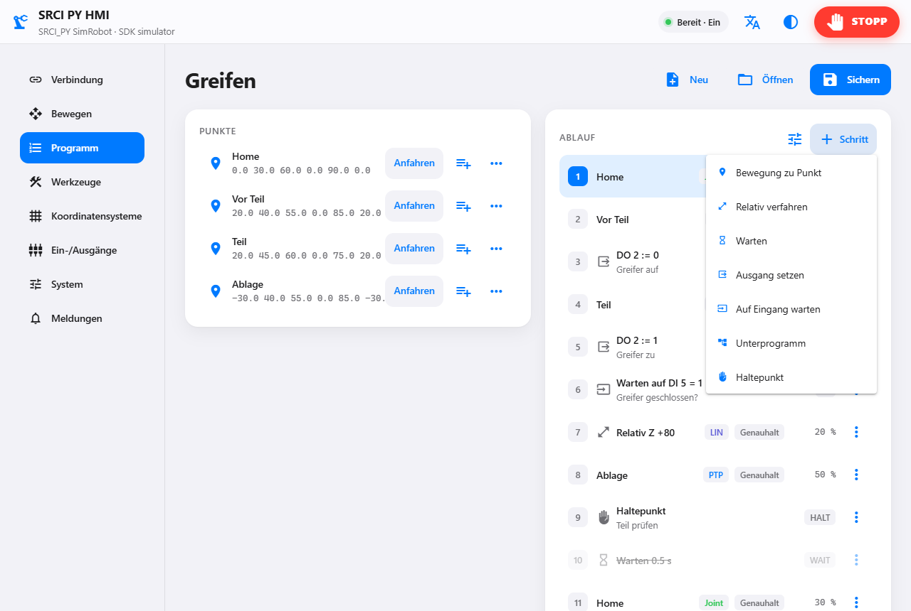

### Schrittarten

| Schritt | Wirkung |
|---|---|
| **Bewegung zu Punkt** | LIN (gerade Bahn), PTP (schnellster Weg, kartesisches Ziel), Joint (Achswinkel des Punkts), CIRC (Kreisbogen über einen Hilfspunkt) |
| **Relativ verfahren** | um einen Versatz, LIN/PTP im Werkzeug oder Koordinatensystem, Joint um Achswinkel |
| **Warten** | Wartezeit in s |
| **Ausgang setzen** | digitalen Ausgang ein- oder ausschalten (z. B. Greifer) |
| **Auf Eingang warten** | bis ein digitaler Eingang den Wert hat; Timeout in s, 0 = endlos |
| **Unterprogramm** | Unterprogramm der Robotersteuerung über Job-ID aufrufen (mit Daten-Bytes) |
| **Haltepunkt** | Programm wartet, bis **Fortsetzen** getippt wird |

Warten, Ausgang, Eingang und Unterprogramm laufen erst, **wenn die Bewegungen davor fertig sind**
(Genauhalt davor).

### Schritt bearbeiten

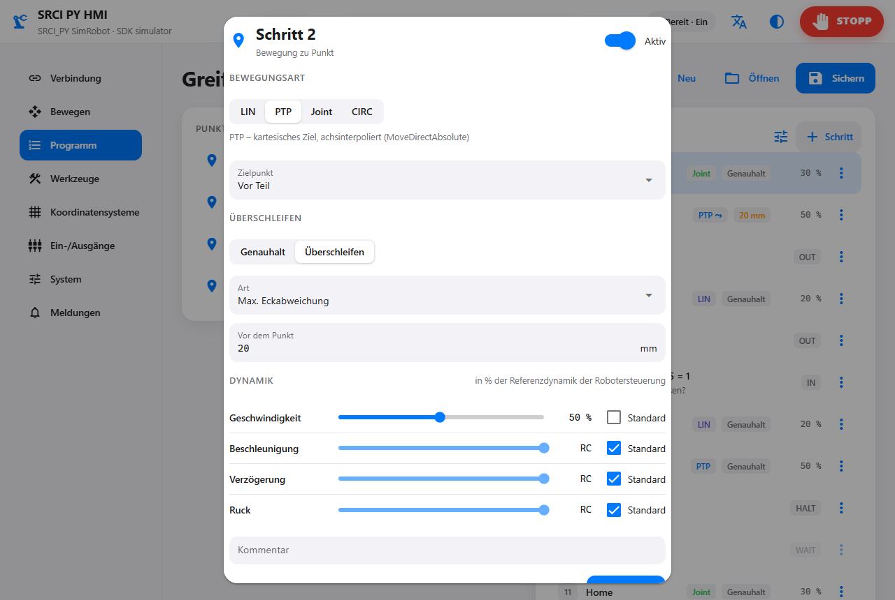

- **Aktiv** aus = Schritt wird übersprungen.
- **Bewegungsart** und **Zielpunkt** (bei CIRC zusätzlich der **Hilfspunkt**: der Bogen beginnt an
  der aktuellen Position, läuft durch den Hilfspunkt zum Zielpunkt).
- **Überschleifen:** **Genauhalt** (Roboter hält am Punkt) oder **Überschleifen** mit Art und Wert,
  z. B. „Max. Eckabweichung 20 mm“. Arten, die der Roboter in dieser Verbindung abgelehnt hat,
  sind mit „vom Roboter abgelehnt“ markiert, angenommene mit ✓. (JAKA MiniCobo: nur
  „Max. Eckabweichung“.)
- **Dynamik:** Geschwindigkeit, Beschleunigung, Verzögerung, Ruck in % der Referenzdynamik oder
  **Standard** (= Standarddynamik der Robotersteuerung, siehe [System](#10-system)).
- **Kommentar:** erscheint im Ablauf unter dem Schritt.

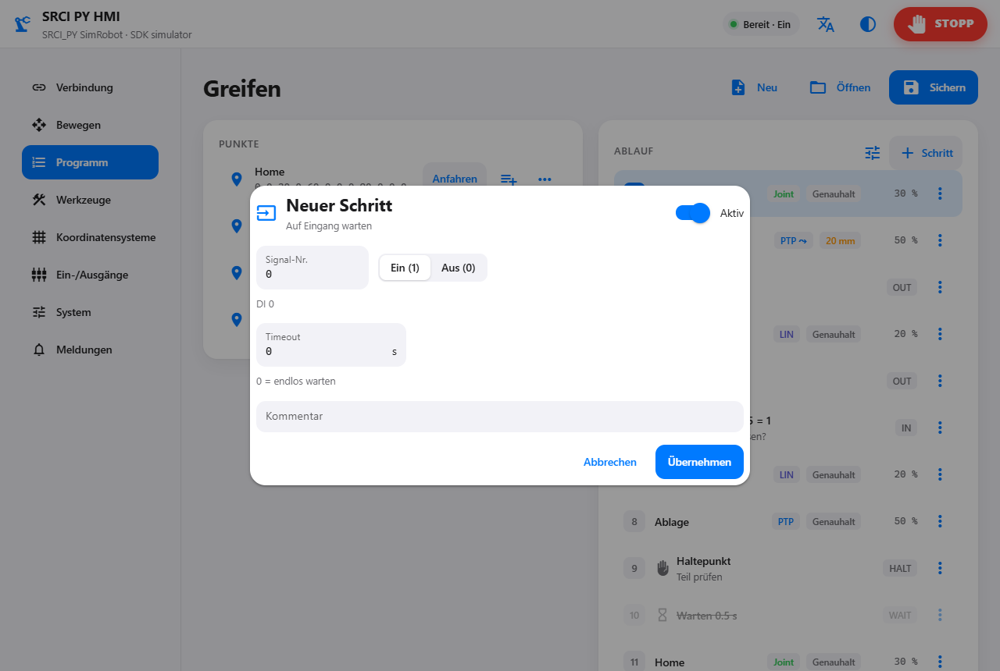

Bei Ein- und Ausgängen ist die **Signal-Nr.** Byte · 8 + Bit (Signal 13 = Byte 1, Bit 5). Unter
der Nummer steht die Bezeichnung des Signals, wenn auf der Seite
[Ein-/Ausgänge](#9-ein-ausgänge-und-register) eine vergeben wurde.

### Ablauf-Einstellungen

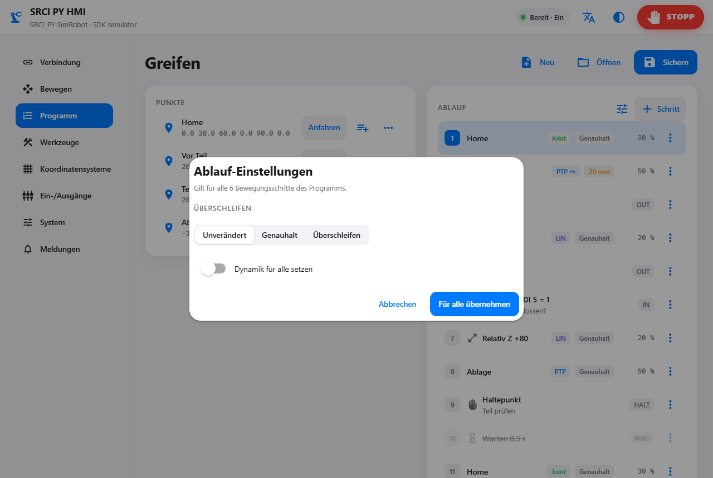

Setzt für **alle Bewegungsschritte** auf einmal das Überschleifen (unverändert, Genauhalt oder
Überschleifen mit Art und Wert) und auf Wunsch die Dynamik.

### Sichern und Öffnen

Programme liegen als JSON-Dateien im Ordner `programs` (Option `--programs`) und lassen sich
versionieren oder austauschen. **Sichern** speichert unter dem Programmnamen, **Öffnen** listet die
Programme, neueste zuerst.

---

## 6. Programm abfahren

| Taste | Wirkung |
|---|---|
| **Start** (halten) | fährt das Programm ab dem Startschritt ab |
| **Einzelschritt** (halten) | fährt nur den Startschritt; danach steht der nächste Schritt als Startschritt bereit |
| ⏮ **Schritt zurück** (halten) | fährt den vorherigen Bewegungsschritt an |
| **Ohne Halten fahren** | Start, Einzelschritt, Schritt zurück, Anfahren und Grundstellung fahren mit einem Tipp, ohne Halten |

Während des Programms zeigt eine **Statuszeile** über dem Ablauf den laufenden Schritt und einen
Fortschrittsbalken; der laufende Schritt ist blau hinterlegt. Am Ende erscheint „Programm beendet“.

### Pause, Freifahren, Zurück zur Bahn

1. **Pause** in der Kopfzeile hält die Bewegung an (das Programm wartet).
2. Bei Bedarf freifahren: Tippen oder Handführen ist während der Pause möglich (der Roboter
   wechselt dabei in die Sekundärsequenz).
3. **Zurück zur Bahn** (in der Statuszeile, halten) fährt zurück auf die unterbrochene Bahn.
4. **Fortsetzen** fährt das Programm weiter.

Pause ist vor allem bei **Ohne Halten fahren** sinnvoll – mit Halten stoppt ja schon das Loslassen.

### Haltepunkt

Erreicht das Programm einen Haltepunkt, zeigt die Kopfzeile „Wartet am Haltepunkt“. Mit
**Fortsetzen** (Kopfzeile oder Statuszeile) geht es weiter.

**STOPP** beendet das Programm. Neu starten mit **Start** ab dem gewählten Schritt.

---

## 7. Werkzeuge und Lasten

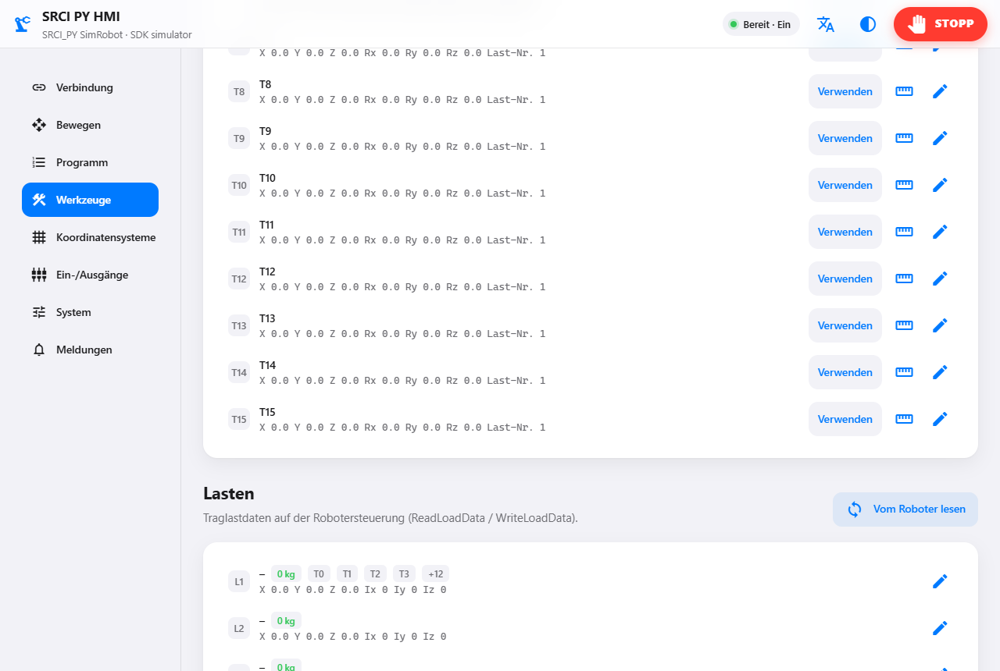

Die Werkzeugtabelle steht auf der Robotersteuerung. Sie wird nach dem Verbinden automatisch
gelesen; **Vom Roboter lesen** liest sie erneut.

| Bedienung | Wirkung |
|---|---|
| **Verwenden** | Werkzeug aktiv setzen (Anzeige, kartesisches Tippen, Teachen) |
| 📏 **Vermessen** | Werkzeug mit dem Assistenten vermessen |
| ✏ **Bearbeiten** | Bezeichnung (nur lokal), X, Y, Z, Rx, Ry, Rz, Last-Nr., externer TCP; **Auf Roboter schreiben** |

T0 (Flansch) ist fest. Die Bezeichnungen („Greifer“ …) speichert die HMI in
`programs/labels.json`.

### Werkzeug vermessen

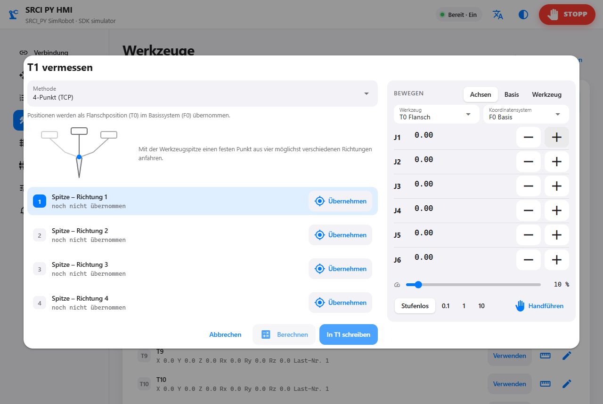

1. **Methode** wählen. Die Skizze und der Text daneben erklären, welche Positionen nötig sind.
2. Mit den Tipp-Tasten **rechts im Dialog** (oder Handführen) die erste Position anfahren und
   **Übernehmen** tippen. Der Haken zeigt übernommene Positionen; die nächste ist blau hinterlegt.
3. Alle Positionen übernehmen, dann **Berechnen**. Das Ergebnis erscheint mit dem TCP-Fehler
   (max. und mittel, in mm) – je kleiner, desto besser.
4. **In T… schreiben** überträgt das Ergebnis auf die Robotersteuerung.

| Methode | Positionen |
|---|---|
| **4-Punkt (TCP)** / **3-Punkt (TCP)** | mit der Werkzeugspitze einen festen Punkt aus 4 bzw. 3 möglichst verschiedenen Richtungen anfahren |
| **5-Punkt** / **6-Punkt** (TCP + Orientierung) | wie 3- bzw. 4-Punkt, dann je eine Position in +X und +Z des Werkzeugs |
| **2-Punkt + Z** (SCARA) | zwei Positionen am Fixpunkt, Länge Z und Orientierung eingeben |
| **ABC Welt** | Werkzeug ausrichten: +X parallel −Z der Welt, +Y parallel +Y, +Z parallel +X |
| **ABC 2-Punkt** | Ursprung, Punkt in +X des Werkzeugs, Punkt in der XY-Ebene |

Die Positionen werden als Flansch (T0) im Basissystem (F0) übernommen.

**Roboter ohne Werkzeugberechnung** (z. B. JAKA MiniCobo, nur Profil Core): Der Assistent meldet
„die HMI berechnet das Ergebnis selbst“ und bietet 4-Punkt, 3-Punkt und ABC Welt an. Bei 3-/4-Punkt
bleibt die Orientierung des Werkzeugs unverändert.

### Lasten

Unter der Werkzeugtabelle: die Traglasten der Robotersteuerung (Masse, Schwerpunkt bezogen auf
den Flansch, Massenträgheit). Die Chips zeigen, welche Werkzeuge die Last nutzen. **✏** öffnet
den Dialog, **Auf Roboter schreiben** überträgt. Falsche Lastdaten verschlechtern die Bahn und
können die Kollisionserkennung auslösen.

---

## 8. Koordinatensysteme

Wie die Werkzeuge: Tabelle der Robotersteuerung, **Verwenden**, **Bearbeiten** (mit
Bezugssystem), **Vermessen**. F0 (Basis) ist fest.

Im Dialog **Bearbeiten** setzt **Aktuelle TCP-Position übernehmen** den Ursprung auf die aktuelle
TCP-Position (aktives Werkzeug, im gewählten Bezugssystem). Unter **Roboter bewegen** lässt sich
der Roboter dafür direkt im Dialog verfahren.

### Koordinatensystem vermessen

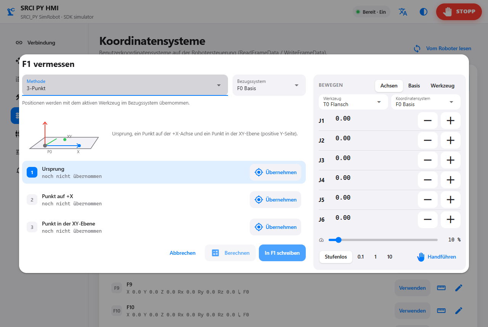

1. **Methode** und **Bezugssystem** wählen.
2. Im Tipp-Feld rechts das **Werkzeug** wählen, mit dem gemessen wird (z. B. die Messspitze).
3. Positionen anfahren und **Übernehmen**, dann **Berechnen** und **In F… schreiben**.

| Methode | Positionen |
|---|---|
| **3-Punkt** | Ursprung, ein Punkt auf der +X-Achse, ein Punkt in der XY-Ebene (auf der positiven Y-Seite) |
| **4-Punkt** | wie 3-Punkt an einem Hilfssystem, dann der verschobene Ursprung (z. B. im Inneren eines Teils) |
| **1-Punkt** | Ursprung und Orientierung aus einer TCP-Position |

Tipp: Die Punkte für X-Achse und XY-Ebene möglichst weit vom Ursprung entfernt wählen – das macht
die Richtung genauer.

---

## 9. Ein-/Ausgänge und Register

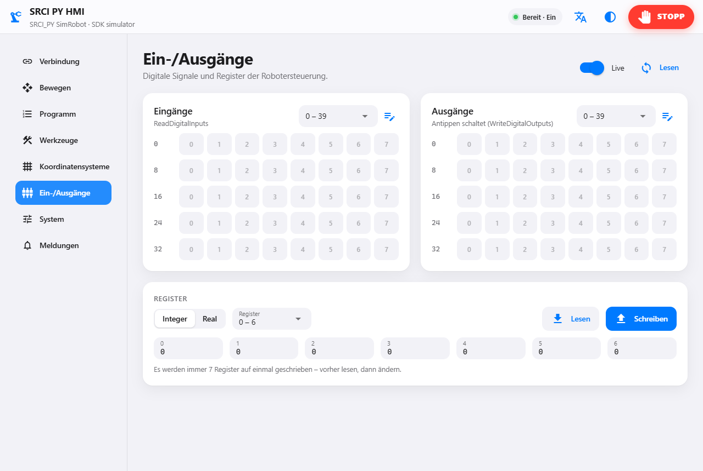

- **Eingänge** (grün = 1) und **Ausgänge** (blau = 1) der Robotersteuerung, je 40 Signale
  (5 Byte). Den Bereich wählt die Auswahl oben rechts (0 – 39, 40 – 79 …). Jede Zeile ist ein Byte,
  links steht die Nummer des ersten Signals.
- **Live** liest die Signale alle 0,5 s, **Lesen** einmal.
- **Ausgang antippen** schaltet ihn um.
- ✎ **Bezeichnungen**: Namen für die Signale vergeben, z. B. „Greifer zu“. Signale mit Namen
  haben einen Punkt; der Name erscheint beim Darüberfahren und im Programm-Editor.
- **Register:** **Integer** oder **Real**, Bereich wählen (immer 7 Register), **Lesen**, Werte
  ändern, **Schreiben**. Es werden immer alle 7 Register geschrieben – deshalb vorher lesen.

---

## 10. System

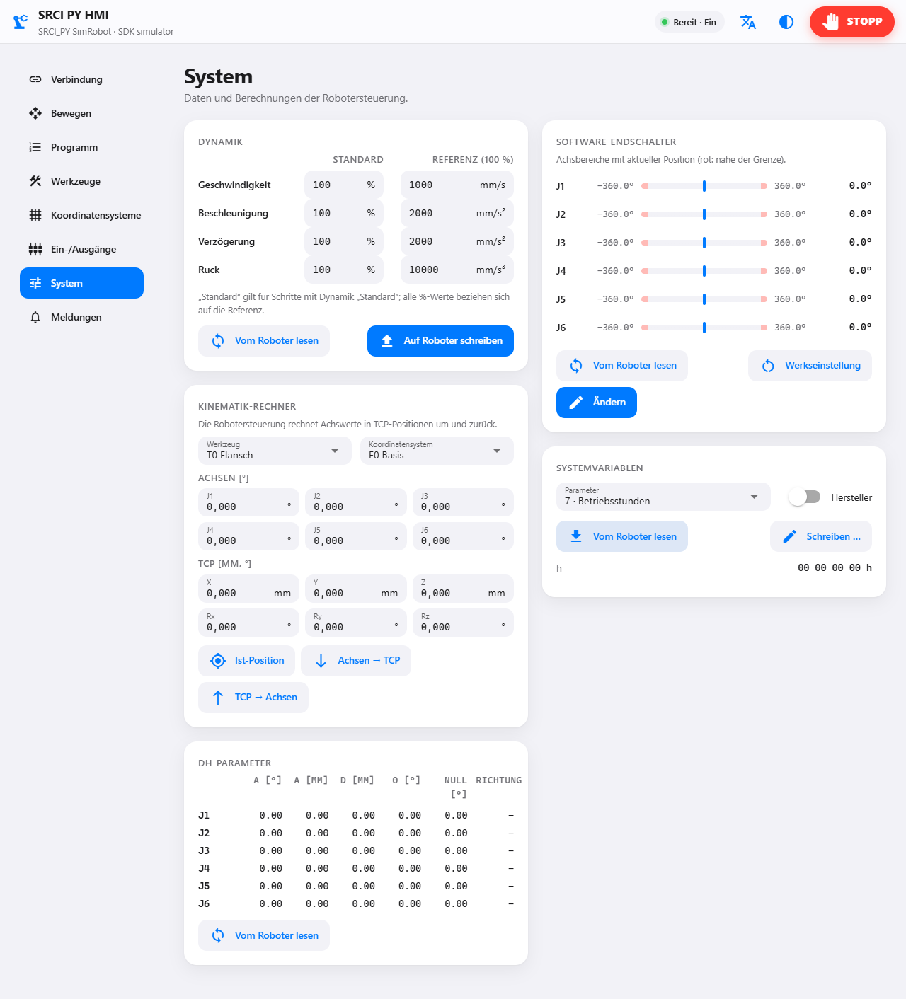

Jede Karte liest mit **Vom Roboter lesen**; geschrieben wird erst mit der jeweiligen
Schreib-Taste.

| Karte | Inhalt |
|---|---|
| **Dynamik** | **Standard** (%, gilt für Schritte mit Dynamik „Standard“) und **Referenz** (100 %: mm/s, mm/s², mm/s³) |
| **Software-Endschalter** | Bereich jeder Achse mit der aktuellen Position (Marke rot = nahe an der Grenze). **Ändern** schreibt neue Grenzen, **Werkseinstellung** setzt sie zurück. Meldet die Steuerung „Neustart nötig“, erscheint ein Hinweis. |
| **Kinematik-Rechner** | Achswerte → TCP und TCP → Achswerte mit der Kinematik der Robotersteuerung, für Werkzeug und Koordinatensystem nach Wahl; **Ist-Position** füllt die aktuellen Werte ein |
| **DH-Parameter** | α, a, d, θ, Nullposition und Drehrichtung je Achse (nur lesen) |
| **Systemvariablen** | Parameter der Standardliste wählen (z. B. 7 Betriebsstunden, 32 LifeSign-Timeout) und lesen; beschreibbare mit **Schreiben …** ändern. **Hersteller** schaltet auf herstellerspezifische Parameter um (ID, Unterparameter, Datentyp laut Dokumentation des Roboterherstellers). |

---

## 11. Meldungen

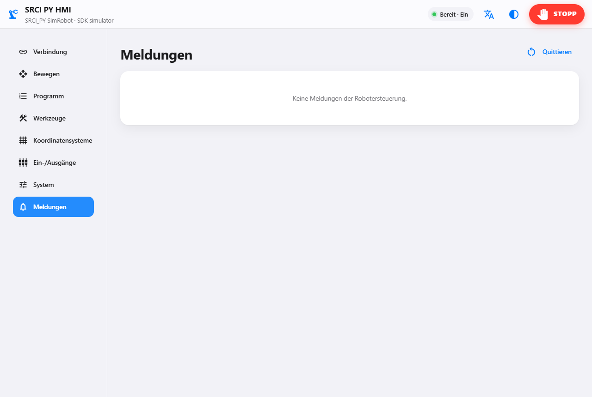

Meldungen der Robotersteuerung, neueste oben, mit Schwere (Fehler rot, Warnung orange, Info blau),
Code (16#…) und Zeitpunkt, zu dem die HMI sie zuerst gesehen hat. **Quittieren** quittiert Fehler
der Robotersteuerung. Darüber steht der letzte Fehler eines Befehls der HMI.

---

## 12. Was die Robotersteuerung nicht kann

Beim Verbinden meldet die Robotersteuerung ihre Funktionen (`RCSupportedFunctions`, Karte
*Fähigkeiten* auf der Verbindungsseite). Was sie nicht meldet, sendet die HMI nie:

- Tasten und Schalter sind gesperrt oder ausgeblendet (z. B. Handführen, Betriebsart,
  Verschieben/Spiegeln).
- Schritte, die eine fehlende Funktion brauchen, sind rot durchgestrichen und mit einem Hinweis
  versehen; das Programm startet dann nicht.
- Seiten zeigen einen Hinweis „Vom Roboter nicht unterstützt: …“.
- Kann die Steuerung weder tippen noch handführen, fehlen in den Dialogen die Tipp-Tasten.

Beispiel JAKA MiniCobo (nur Profil Core): kein Handführen, keine Betriebsartumschaltung, kein
Kreis, keine relativen Bewegungen, keine E/A-Befehle; Werkzeuge und Koordinatensysteme werden von
der HMI selbst berechnet.

---

## 13. Fehlerbehebung

| Meldung / Verhalten | Ursache | Abhilfe |
|---|---|---|
| „Verbindung fehlgeschlagen“ | Gateway nicht erreichbar, falscher Port oder falsche Telegrammlänge | IP, Port, Länge prüfen; läuft das SPS-Gateway? |
| „Verbindung verloren“ | LifeSign fehlt (Netzwerk, Steuerung) | Verbindung neu aufbauen; LifeSign-Timeout erhöhen (JAKA ≥ 300 ms) |
| `16#8C04` Roboter wegen Fehler abgeschaltet | anstehender Fehler der Steuerung | **Quittieren**, dann einschalten (macht „Roboter einschalten“ automatisch) |
| `16#8F13` beim Tippen | die Steuerung beendet noch die vorige Bewegung | kurz warten und erneut tippen |
| `16#8E05` Überschleifart nicht unterstützt | der Roboter kennt diese Überschleifart nicht | im Schritt eine andere Art wählen (JAKA: Max. Eckabweichung); die Art ist danach markiert |
| Tipp-Tasten grau | Roboter aus, Programm läuft oder Tippen nicht unterstützt | einschalten / Programm beenden |
| „Halten zum Fahren“ stoppt sofort | Taste losgelassen, Tab gewechselt oder WLAN-Aussetzer | Taste gedrückt halten; ggf. **Ohne Halten fahren** (mit Vorsicht) |
| Werte der Systemvariablen sehen falsch aus | Byte-Reihenfolge (die HMI liest little endian) | in den Tooltip schauen (Rohbytes) und mit der Herstellerdoku vergleichen |
| Meldungen und Details für den Support | – | HMI mit `--log hmi.log` starten: die Datei enthält alle Befehle und Antworten |
