# SRCI_PY_HMI – Operating manual

This manual describes how to operate the HMI on a tablet or in the browser: connect and switch on
the robot, jog it, teach points, create and run programs, set up tools and frames, I/O and system
data.

Installation and start are described in the [README](../README.md#installation). The screenshots
show the English user interface (switch the language with the 文A key in the header).

---

## Contents

1. [Safety](#1-safety)
2. [Layout of the user interface](#2-layout-of-the-user-interface)
3. [Connection: connect, switch on, operation mode](#3-connection)
4. [Jog: jogging, hand guiding, teaching](#4-jog)
5. [Program: points and sequence](#5-program)
6. [Running a program, pause, stop point](#6-running-a-program)
7. [Tools and loads](#7-tools-and-loads)
8. [Frames](#8-frames)
9. [I/O and registers](#9-io-and-registers)
10. [System](#10-system)
11. [Messages](#11-messages)
12. [What the robot controller cannot do](#12-what-the-robot-controller-cannot-do)
13. [Troubleshooting](#13-troubleshooting)

---

## 1. Safety

> **SRCI is not a safety interface.** Emergency stop, safeguards and safe speeds remain the task
> of the robot controller. The STOP key of the HMI does not replace the emergency stop.

- **Hold to run:** jogging, hand guiding, **Move to**, **Move to home**, **Return to path** and
  the program start move the robot only **while the key is held**. Releasing it stops the robot.
  The same happens when the browser tab is switched or the connection to the tablet drops
  (after 0.5 s at the latest).
- **Run without holding** (program page) switches holding off for the program, **Move to** and
  **Move to home** – only with a clear working area and the emergency stop within reach.
- The **STOP** key at the top right is always visible and stops jogging, motion and program at
  once.
- By default the HMI can only be reached on the own PC. Whoever opens it to the network with
  `--host 0.0.0.0` allows **everybody who reaches the port to move the robot** – use this only in
  an isolated cell network.

---

## 2. Layout of the user interface

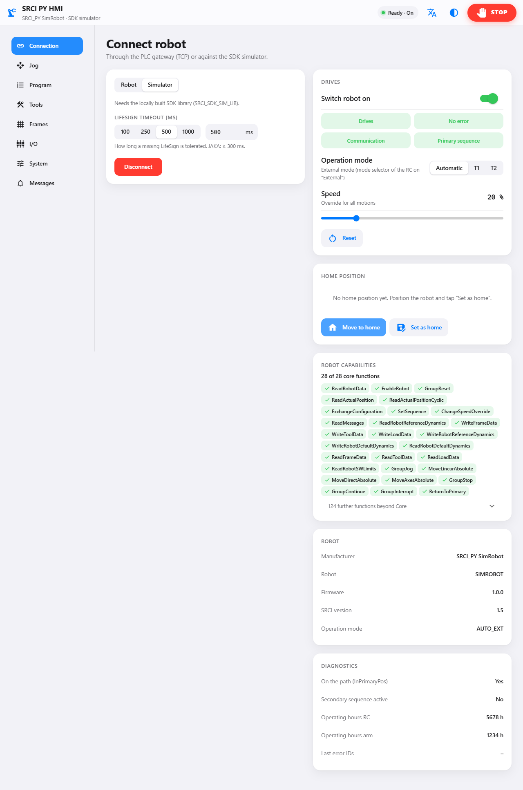

**Header** (always visible):

| Element | Meaning |
|---|---|
| Status | `Ready · On`, `Ready · Off`, `Jogging`, `Moving`, `Program running`, `Interrupted`, `Waiting at stop point`, `Fault`, `Not connected` … dot green = ready, orange = attention, blue = moving, red = error |
| Language | German / English |
| Light / dark | colour scheme |
| **Pause / Continue** | appears only while the robot moves or a program is paused |
| **STOP** | stops everything at once |

**Navigation** on the left (on narrow devices open it with ☰): Connection, Jog, Program, Tools,
Frames, I/O, System, Messages.

The browser remembers the settings of the user interface (page, language, jog speed …). Several
tabs or tablets see the same robot and the same program.

---

## 3. Connection

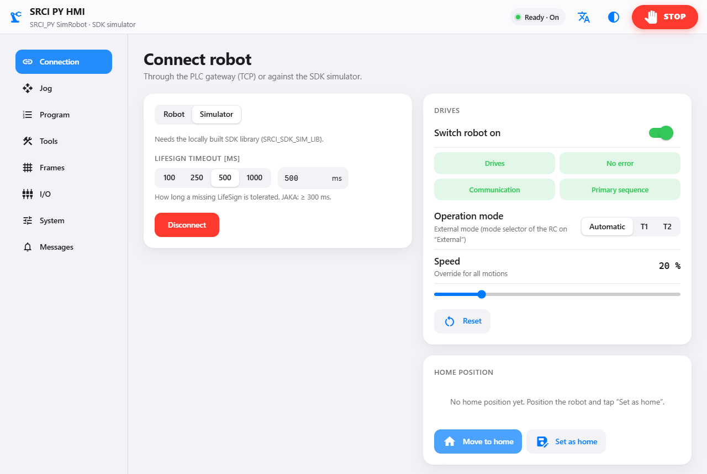

### Connecting

1. Choose **Robot** or **Simulator**.
2. For a robot: check **Gateway IP address**, **Port** and **Telegram length** (default from the
   command line).
3. Choose the **LifeSign timeout** (100 / 250 / 500 / 1000 ms or a free value). It is remembered.
   JAKA MiniCobo: at least 300 ms, 500 ms recommended.
4. Tap **Connect**. After a few seconds the header shows the manufacturer and the *Robot* card the
   robot data. **Disconnect** switches the robot off and closes the connection.

### Drives

| Element | Operation |
|---|---|
| **Switch robot on** | switch. A pending error is acknowledged automatically first. |
| Status tiles | **Drives** · **Error** · **Communication** · **Sequence**: green = OK, orange = attention (e.g. secondary sequence, interrupted), red = error, grey = inactive |
| **Operation mode** | **Automatic**, **T1**, **T2** (external operation modes). The mode selector of the robot controller must be set to "External". |
| **Speed** | override for all motions in % (effective at once) |
| **Reset** | acknowledge errors of the robot controller |

### Home position

- Move the robot to the desired position and tap **Set as home**. The joint values are stored
  together with tool and frame.
- **Move to home** (hold) moves there joint interpolated with the jog speed.

### Capabilities, robot, diagnostics

- **Robot capabilities:** the functions the robot controller reports. Functions it does not
  report are disabled or hidden in the HMI (see [12.](#12-what-the-robot-controller-cannot-do)).
- **Robot:** manufacturer, type, firmware, SRCI version, operation mode.
- **Diagnostics:** on the path, secondary sequence active, operating hours of the controller and
  the arm, the last error IDs.

---

## 4. Jog

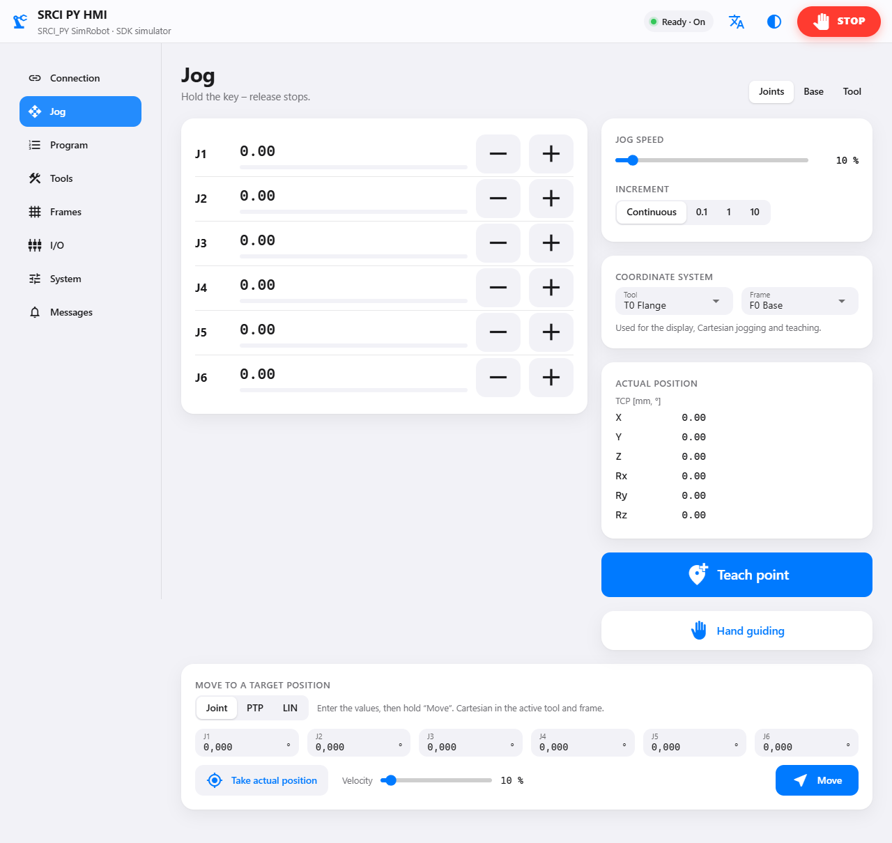

### Jogging

1. Switch the robot on (otherwise a hint with a switch-on key is shown).
2. Choose the mode at the top right:
   - **Joints** – every joint on its own (J1 … J6)
   - **Base** – X, Y, Z, Rx, Ry, Rz in the selected **frame**
   - **Tool** – X, Y, Z, Rx, Ry, Rz in the selected **tool**
3. Hold **−** / **+**. Releasing stops.

| Setting | Meaning |
|---|---|
| **Jog speed** | % of the jog speed of the robot controller |
| **Increment** | **Continuous** (moves while held) or 0.1 / 1 / 10 mm resp. ° per key press |
| **Coordinate system** | tool and frame: used for the position display, Cartesian jogging and teaching |

The bar below each value shows the position roughly (joints ±180°, X/Y/Z ±1000 mm).

### Hand guiding

Hold **Hand guiding** and guide the robot by hand (only if the robot controller offers it, e.g.
cobots). Releasing ends hand guiding.

### Teach point

Bring the robot into position and tap **Teach point**. The points are named P1, P2 … and store
joint values, TCP position, tool and frame. They appear on the program page.

### Move to a target position

1. Choose **Joint**, **PTP** or **LIN**.
2. Enter the values – for Joint the joint angles, for PTP/LIN X … Rz in the active tool and
   frame. **Take actual position** fills in the current values.
3. Set the speed and hold **Move**.

---

## 5. Program

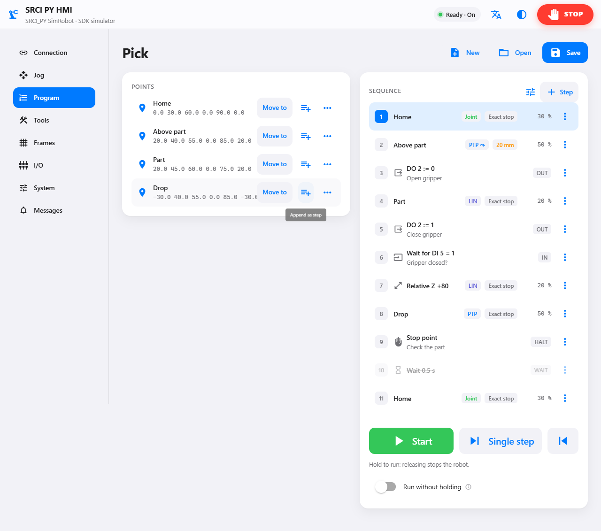

A program consists of **points** (left) and the **sequence** (right, the steps). At the top:
program name (tap to change it), **New**, **Open**, **Save**. "not saved" below the name shows
unsaved changes.

### Points

| Operation | Effect |
|---|---|
| **Move to** (hold) | moves joint interpolated with 20 % to the point |
| ≡+ | appends a motion to this point to the sequence |
| ⋯ → **Teach again** | overwrites the point with the actual position |
| ⋯ → **Edit** | change name, TCP values, joint values, tool, frame, comment |
| ⋯ → **Shift / mirror …** | let the robot controller calculate a new point (only if it offers this) |
| ⋯ → **Rename** / **Delete** | deleting also removes the steps that use the point |

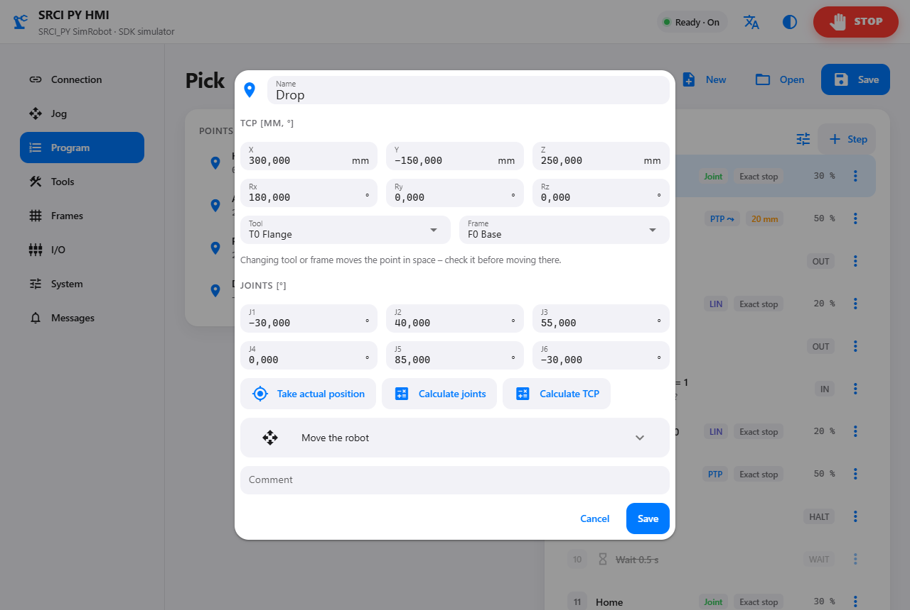

In the **Edit** dialog of a point:

- **Take actual position** sets joint and TCP values to the actual position.
- **Calculate joints** / **Calculate TCP** use the kinematics of the robot controller to calculate
  the joints from the TCP values or the other way round.
- **Move the robot** opens jog keys to move the robot without leaving the dialog.
- When the tool or frame is changed, the numbers stay the same – the point is then somewhere else
  in space. Check it before moving there.

**Shift / mirror:** choose the transformation (shift by vector, mirror at point, line or plane,
rotate around line), enter the values, **As new point** or **Replace point**.

### Sequence

| Operation | Effect |
|---|---|
| tap a step | opens the editor |
| tap the number | selects the **start step** (blue background) |
| ⋮ | Edit, **Skip** / **Run again**, Duplicate, Move up, Move down, Delete |
| **+ Step** | insert a new step (after the selected step) |
| slider icon next to **+ Step** | **Sequence settings** for all steps |

Skipped steps are struck through and left out when the program runs. Labels on the right: motion
type (**Joint**, **PTP**, **LIN**, **CIRC**, `⤳` = blended), blending (`Exact stop` or value),
velocity. Struck through in red = the robot controller does not support it or refused it.

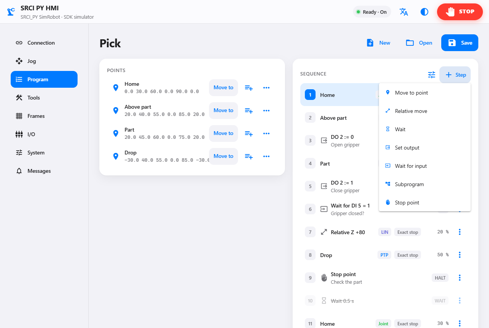

### Step kinds

| Step | Effect |
|---|---|
| **Move to point** | LIN (straight path), PTP (fastest path, Cartesian target), Joint (joint angles of the point), CIRC (arc through a via point) |
| **Relative move** | by an offset, LIN/PTP in the tool or the frame, Joint by joint angles |
| **Wait** | wait time in s |
| **Set output** | switch a digital output on or off (e.g. gripper) |
| **Wait for input** | until a digital input has the value; timeout in s, 0 = endless |
| **Subprogram** | call a subprogram of the robot controller by its job ID (with data bytes) |
| **Stop point** | the program waits until **Continue** is tapped |

Wait, output, input and subprogram run **when the motions before them are done** (exact stop
before).

### Edit step

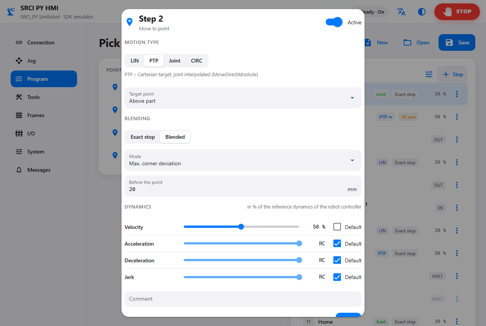

- **Active** off = the step is skipped.
- **Motion type** and **Target point** (for CIRC also the **Via point**: the arc starts at the
  actual position and runs through the via point to the target).
- **Blending:** **Exact stop** (the robot stops at the point) or **Blended** with mode and value,
  e.g. "Max. corner deviation 20 mm". Modes the robot refused in this connection are marked
  "refused by the robot", accepted ones with ✓. (JAKA MiniCobo: only "Max. corner deviation".)
- **Dynamics:** velocity, acceleration, deceleration, jerk in % of the reference dynamics or
  **Default** (= default dynamics of the robot controller, see [System](#10-system)).
- **Comment:** shown below the step in the sequence.

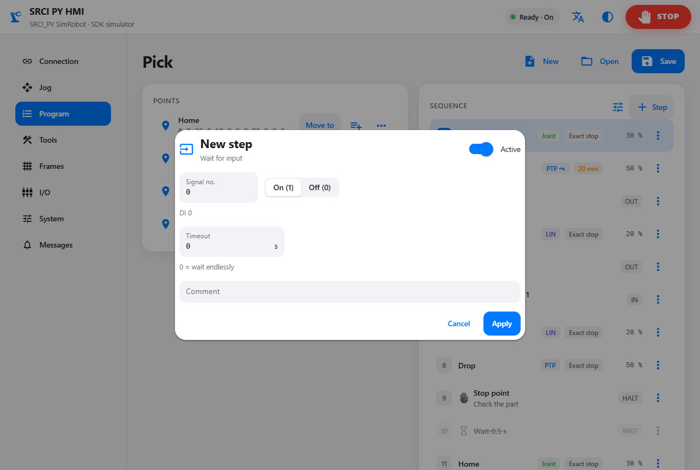

For inputs and outputs the **Signal no.** is byte · 8 + bit (signal 13 = byte 1, bit 5). Below the
number the label of the signal is shown, if one was given on the [I/O](#9-io-and-registers) page.

### Sequence settings

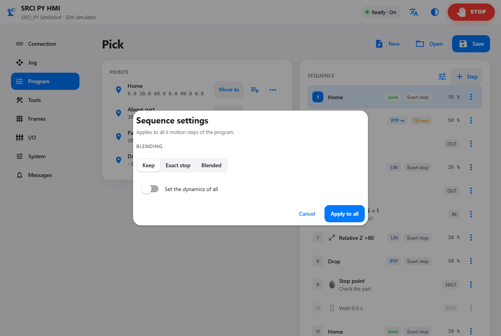

Sets the blending (keep, exact stop or blended with mode and value) and, if wanted, the dynamics
of **all motion steps** at once.

### Save and open

Programs are JSON files in the folder `programs` (option `--programs`) and can be versioned or
exchanged. **Save** stores under the program name, **Open** lists the programs, newest first.

---

## 6. Running a program

| Key | Effect |
|---|---|
| **Start** (hold) | runs the program from the start step |
| **Single step** (hold) | runs only the start step; then the next step is the start step |
| ⏮ **Step back** (hold) | moves to the previous motion step |
| **Run without holding** | Start, Single step, Step back, Move to and Move to home move with one tap, without holding |

While the program runs, a **status line** above the sequence shows the running step and a
progress bar; the running step has a blue background. At the end "Program finished" is shown.

### Pause, jog away, return to path

1. **Pause** in the header stops the motion (the program waits).
2. Jog away if needed: jogging and hand guiding are possible during the pause (the robot switches
   to the secondary sequence).
3. **Return to path** (in the status line, hold) moves back to the interrupted path.
4. **Continue** goes on with the program.

Pause is mainly useful with **Run without holding** – with holding, releasing the key already
stops the robot.

### Stop point

When the program reaches a stop point, the header shows "Waiting at stop point". **Continue**
(header or status line) goes on.

**STOP** ends the program. Start again with **Start** from the selected step.

---

## 7. Tools and loads

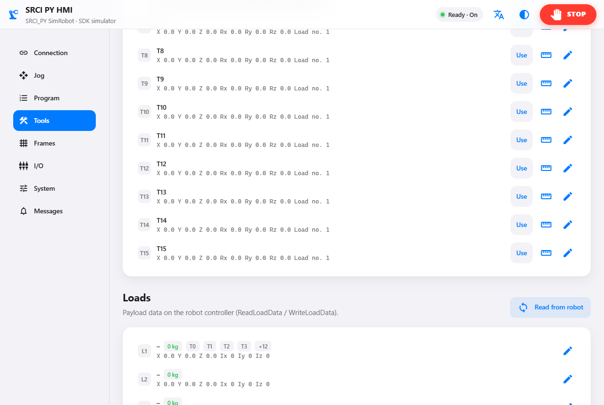

The tool table is stored on the robot controller. It is read automatically after connecting;
**Read from robot** reads it again.

| Operation | Effect |
|---|---|
| **Use** | make the tool active (display, Cartesian jogging, teaching) |
| 📏 **Measure** | measure the tool with the wizard |
| ✏ **Edit** | label (local only), X, Y, Z, Rx, Ry, Rz, load no., external TCP; **Write to robot** |

T0 (flange) is fixed. The HMI stores the labels ("Gripper" …) in `programs/labels.json`.

### Measure a tool

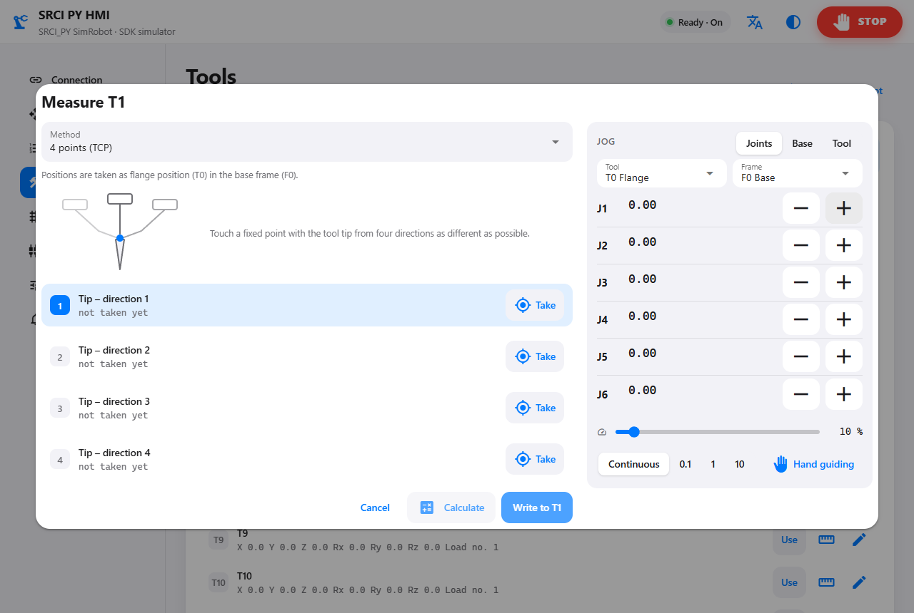

1. Choose the **Method**. The sketch and the text next to it explain which positions are needed.
2. Move to the first position with the jog keys **on the right of the dialog** (or hand guiding)
   and tap **Take**. A check mark shows the positions taken; the next one has a blue background.
3. Take all positions, then **Calculate**. The result is shown with the TCP error (max. and mean,
   in mm) – the smaller, the better.
4. **Write to T…** transfers the result to the robot controller.

| Method | Positions |
|---|---|
| **4 points (TCP)** / **3 points (TCP)** | touch a fixed point with the tool tip from 4 resp. 3 directions as different as possible |
| **5 points** / **6 points** (TCP + orientation) | as 3 resp. 4 points, then one position each in +X and +Z of the tool |
| **2 points + Z** (SCARA) | two positions at the fixed point, enter length Z and orientation |
| **ABC world** | align the tool: +X parallel to −Z of the world, +Y to +Y, +Z to +X |
| **ABC 2 points** | origin, a point in +X of the tool, a point in the XY plane |

The positions are taken as flange (T0) in the base frame (F0).

**Robots without tool calculation** (e.g. JAKA MiniCobo, profile Core only): the wizard reports
"the HMI calculates the result itself" and offers 4 points, 3 points and ABC world. With 3/4 points
the orientation of the tool stays unchanged.

### Loads

Below the tool table: the payloads of the robot controller (mass, center of gravity relative to
the flange, moments of inertia). The chips show which tools use the load. **✏** opens the dialog,
**Write to robot** transfers it. Wrong load data degrade the path and may trigger the collision
detection.

---

## 8. Frames

Like the tools: table of the robot controller, **Use**, **Edit** (with reference frame),
**Measure**. F0 (base) is fixed.

In the **Edit** dialog, **Take the actual TCP position** sets the origin to the actual TCP position
(active tool, in the selected reference frame). **Move the robot** lets you move the robot for this
directly in the dialog.

### Measure a frame

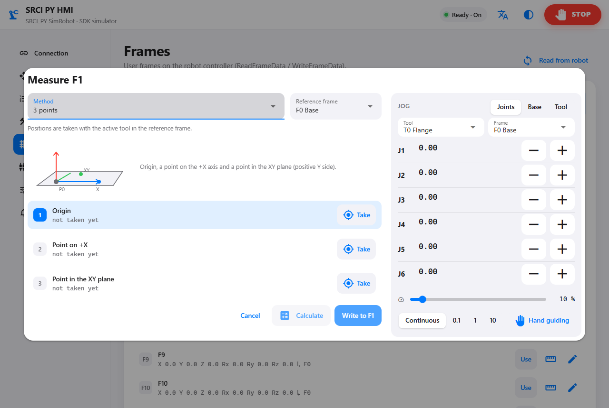

1. Choose the **Method** and the **Reference frame**.
2. In the jog pad on the right, choose the **Tool** used for measuring (e.g. the measuring tip).
3. Move to the positions and tap **Take**, then **Calculate** and **Write to F…**.

| Method | Positions |
|---|---|
| **3 points** | origin, a point on the +X axis, a point in the XY plane (on the positive Y side) |
| **4 points** | as 3 points on an auxiliary frame, then the shifted origin (e.g. inside a part) |
| **1 point** | origin and orientation from one TCP position |

Tip: choose the points for the X axis and the XY plane as far from the origin as possible – this
makes the directions more accurate.

---

## 9. I/O and registers

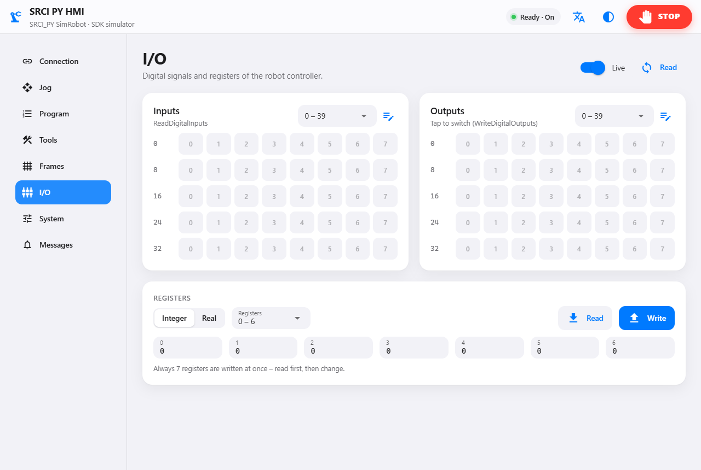

- **Inputs** (green = 1) and **outputs** (blue = 1) of the robot controller, 40 signals each
  (5 bytes). The select at the top right chooses the range (0 – 39, 40 – 79 …). Every row is a
  byte; on the left is the number of its first signal.
- **Live** reads the signals every 0.5 s, **Read** once.
- **Tap an output** to switch it.
- ✎ **Labels**: give the signals names, e.g. "Close gripper". Signals with a name have a dot; the
  name is shown when hovering and in the program editor.
- **Registers:** **Integer** or **Real**, choose the range (always 7 registers), **Read**, change
  the values, **Write**. Always all 7 registers are written – so read them first.

---

## 10. System

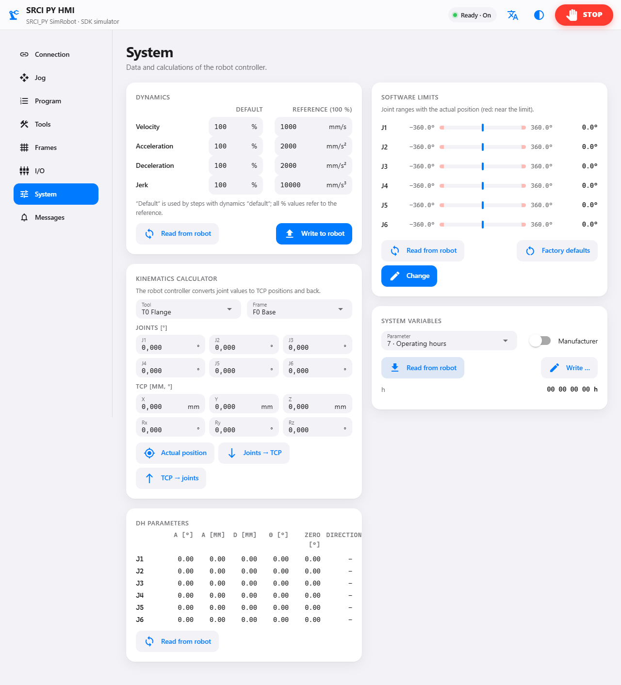

Every card reads with **Read from robot**; it writes only with its write key.

| Card | Content |
|---|---|
| **Dynamics** | **Default** (%, used by steps with dynamics "Default") and **Reference** (100 %: mm/s, mm/s², mm/s³) |
| **Software limits** | range of every joint with the actual position (marker red = near the limit). **Change** writes new limits, **Factory defaults** resets them. If the controller requests a restart, a hint is shown. |
| **Kinematics calculator** | joints → TCP and TCP → joints with the kinematics of the robot controller, for any tool and frame; **Actual position** fills in the current values |
| **DH parameters** | α, a, d, θ, zero position and direction of every joint (read only) |
| **System variables** | choose a parameter of the standard list (e.g. 7 operating hours, 32 LifeSign timeout) and read it; change writable ones with **Write …**. **Manufacturer** switches to manufacturer specific parameters (ID, sub-parameter, data type according to the documentation of the robot maker). |

---

## 11. Messages

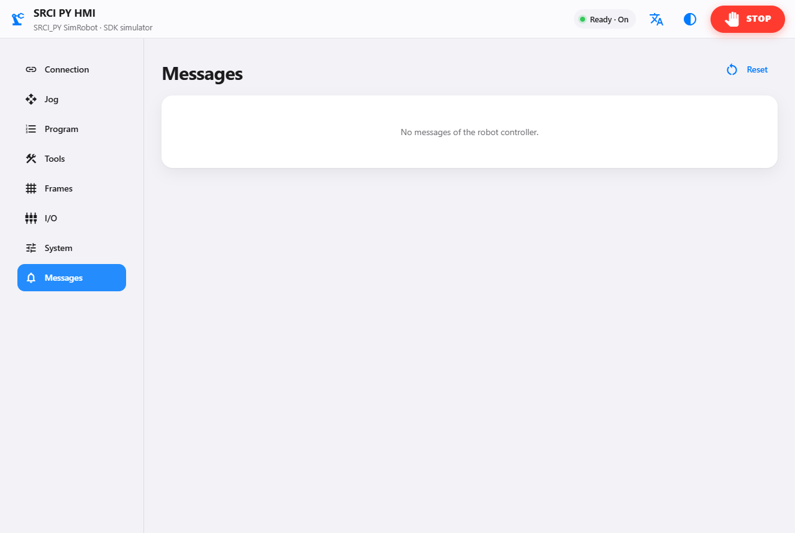

Messages of the robot controller, newest first, with severity (error red, warning orange, info
blue), code (16#…) and the time the HMI first saw them. **Reset** acknowledges errors of the robot
controller. Above the list the last error of a command of the HMI is shown.

---

## 12. What the robot controller cannot do

When connecting, the robot controller reports its functions (`RCSupportedFunctions`, card *Robot
capabilities* on the connection page). The HMI never sends what it does not report:

- Keys and switches are disabled or hidden (e.g. hand guiding, operation mode, shift / mirror).
- Steps that need a missing function are struck through in red with a hint; the program does not
  start then.
- Pages show a hint "Not supported by the robot: …".
- If the controller can neither jog nor guide by hand, the dialogs show no jog keys.

Example JAKA MiniCobo (profile Core only): no hand guiding, no operation mode switching, no arcs,
no relative motions, no I/O commands; tools and frames are calculated by the HMI itself.

---

## 13. Troubleshooting

| Message / behaviour | Cause | Remedy |
|---|---|---|
| "Connection failed" | gateway not reachable, wrong port or telegram length | check IP, port, length; is the PLC gateway running? |
| "Connection lost" | LifeSign missing (network, controller) | connect again; increase the LifeSign timeout (JAKA ≥ 300 ms) |
| `16#8C04` robot disabled due to an error | pending error of the controller | **Reset**, then switch on (**Switch robot on** does this automatically) |
| `16#8F13` when jogging | the controller is still finishing the previous motion | wait a moment and jog again |
| `16#8E05` blending mode not supported | the robot does not know this blending mode | choose another mode in the step (JAKA: Max. corner deviation); the mode is marked afterwards |
| jog keys grey | robot off, program running or jogging not supported | switch on / end the program |
| hold to run stops at once | key released, tab switched or Wi-Fi dropout | keep the key pressed; if needed **Run without holding** (with care) |
| values of system variables look wrong | byte order (the HMI reads little endian) | look at the tooltip (raw bytes) and compare with the documentation of the robot maker |
| messages and details for support | – | start the HMI with `--log hmi.log`: the file contains all commands and responses |
